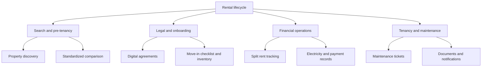

# Rental App

An integrated digital operating system for the urban rental housing lifecycle.

## The problem

Rental platforms make it easier to discover a home, but the relationship often becomes fragmented after the initial search. Lease documents, move-in records, rent splitting, utility bills, maintenance requests, and payment receipts are commonly spread across WhatsApp, spreadsheets, paper files, and disconnected UPI transactions.

This fragmentation creates:

- Unverified listings and inconsistent property comparisons
- Missing move-in condition records and security-deposit disputes
- Opaque shared-rent and electricity calculations
- Maintenance requests without an accountable status history
- Scattered agreements, KYC records, and payment receipts
- Limited visibility for owners managing multiple properties

## Our approach

Rental App brings tenants and property owners into one two-sided workflow covering discovery, onboarding, tenancy operations, and ongoing communication.



## Product capabilities

### Move-in baseline and inventory

The move-in checklist and inventory workflow creates a shared record of property condition and furnishings. A timestamped baseline gives both parties a clearer reference during the tenancy and at move-out.

### Split rent and utility records

Tenants can organize shared-rent contributions, while electricity and payment records make charges easier to understand and reconcile.

### Maintenance tracking

Tenants can raise maintenance requests and follow their status. Owners can review requests, update progress, and communicate changes through the owner dashboard and broadcast tools.

### Agreements and document access

Digital agreements, tenant documents, payment history, and onboarding checklists are brought together in one authenticated workspace.

### Owner operations

Owners can list and manage properties, review bookings, manage tenants, track dashboard activity, and communicate announcements without relying on separate spreadsheets.

## Expected impact

The platform is designed to reduce operational friction by making records visible, responsibilities explicit, and important lifecycle events auditable:

| Challenge | Intended improvement |
| --- | --- |
| Move-out disputes | A shared move-in checklist and inventory baseline |
| Utility calculations | Visible readings and payment records |
| Shared rent collection | Clear contribution tracking |
| Maintenance follow-up | Status-based requests and notifications |
| Compliance records | Centralized agreements and documents |

## Technology

- **Frontend:** React, TypeScript, Vite
- **Backend:** Node.js, Express, TypeScript
- **Data:** Prisma with SQLite
- **Authentication:** JWT and mobile OTP flows
- **Realtime features:** Socket.IO

## Repository structure

```text
backend/   Express API, Prisma client, authentication, and realtime services
web-app/   React frontend and tenant/owner/admin screens
```

## Getting started

Install dependencies in both application packages:

```bash
cd backend && npm ci
cd ../web-app && npm ci
```

Run the backend and frontend from separate terminals:

```bash
cd backend && npm run dev
cd web-app && npm run dev
```

Build and lint checks:

```bash
cd backend && npm run build
cd web-app && npm run build && npm run lint
```
